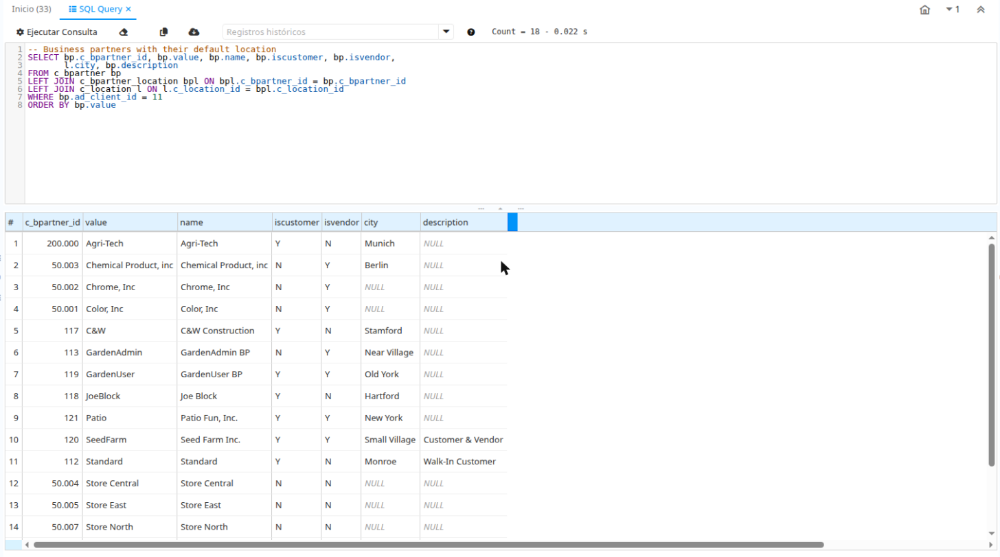

# com.soropeza.sqlquery — SQL Query Enhanced Form

*Read in [English](README.md).*

Plugin OSGi para **iDempiere 13** (Java 17, PostgreSQL y Oracle) que reemplaza la forma estándar
*SQL Query* por una versión mejorada. Versión `13.1.0` (ver [CHANGELOG](CHANGELOG.md)).



## Basado en WSQLQuery

`WSQLQueryEnhanced` deriva de la forma del core `org.adempiere.webui.apps.form.WSQLQuery`
(Carlos Ruiz, globalqss - bxservice) y conserva su lógica de seguridad y sus SysConfig
(`FORM_SQL_QUERY_ALLOWED_KEYWORDS`, `FORM_SQL_QUERY_MAX_RECORDS`, `FORM_SQL_QUERY_TIMEOUT_IN_SECONDS`,
`FORM_SQL_QUERY_LOG_ISSUE`). No modifica el core ni el Diccionario: un `IFormFactory` con mayor
ranking devuelve la forma mejorada al abrir *SQL Query*. Deteniendo el bundle vuelve la forma estándar.

## Características

- Editor SQL con resaltado de sintaxis y números de línea ([CodeMirror](https://codemirror.net/5/)
  5.65.16, empaquetado, sin CDN). Se desactiva con el SysConfig `SQLQUERY_ENHANCED_CODE_EDITOR=N`.
- Ejecutar con Ctrl+Enter; con texto seleccionado se ejecuta solo la selección.
- Tab / Shift+Tab para indentar y desindentar.
- Historial de sentencias (últimas 50 por usuario) persistente entre sesiones, leído de `AD_Issue`.
- Valores `NULL` en gris itálica; cantidad de registros y duración en la barra.
- Copiar los resultados (o una fila, con doble clic) al portapapeles y exportar a CSV (UTF-8).

## Instalación

**Servidor:** descargar `com.soropeza.sqlquery-<versión>.jar` de
[Releases](https://github.com/sergioropeza/com.soropeza.sqlquery/releases) e instalarlo desde la
consola web de Felix (`https://<servidor>/osgi/system/console/bundles`, *Install/Update...*,
*Start Bundle*) o desde la consola OSGi:

```
install file:/ruta/com.soropeza.sqlquery-13.1.0.jar
start <bundle-id>
```

**Eclipse:** `File > Import > Existing Projects into Workspace`, agregar el plugin a la Run
Configuration del servidor y levantarlo.

**Compilar:** con Java 17 y Maven 3.9+, `mvn verify` (resuelve iDempiere 13 desde su repositorio
p2 público; el jar queda en `target/`).

## Índice del historial (recomendado)

El historial filtra `AD_Issue` por forma y usuario, y el core no indexa esas columnas. En tablas
`AD_Issue` grandes, crear una vez el índice opcional `ad_issue_formuser_idx` con el usuario
`adempiere`:

```
psql -h <host> -U adempiere -d idempiere -f migration/postgresql/ad_issue_formuser_idx.sql
```

Para Oracle usar `migration/oracle/ad_issue_formuser_idx.sql`. Se elimina con
`DROP INDEX ad_issue_formuser_idx;`.

## Licencia

[GPL-2.0-or-later](LICENSE.md), igual que iDempiere. CodeMirror tiene licencia MIT.
Issues: https://github.com/sergioropeza/com.soropeza.sqlquery/issues
